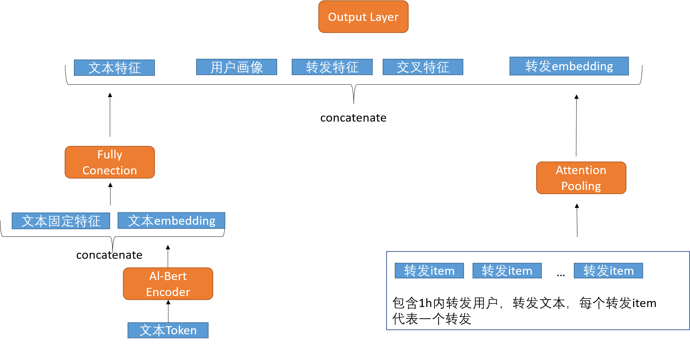
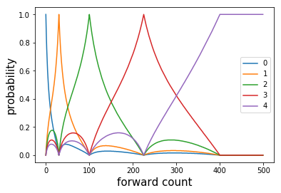

# 比赛背景

微博传播规模预测
比赛链接：http://data.sklccc.com/matchpage?t=context

微博用户画像、微博文本，以及微博的1小时传播特征，预测微博在24小时后的传播量


# 结果
|  Name   | Score  | Rank  | Team member  |
|  ----  | ----  |  ----  |  ----  |
| 长城拿铁小分队  | 70.5129 | 4 |https://github.com/Chenchh12<br>https://github.com/Jaggie-Yan<br>https://github.com/yongruihuang |

# 代码说明

- 0_数据查看+简单特征构造保存中间文件.ipynb:数据分析+融合用户画像文件
- 1_特征构造.ipynb:特征构造代码
- 2_24h特征构造.ipynb：交叉验证利用24小时特征代码
- 3_model_lgb.ipynb：抽取特征利用lgb进行预测
- 4_model_nn_run.ipynb：使用神经网络进行预测
- 5_model_stacking.ipynb：利用stacking进行模型融合

# 特征构造

## 微博用户画像特征

我们发现用户画像表中同一用户对应多条记录，可能是由于不同时间采集所致，于是，我们对同一用户不同条目将其进行统计聚合，用来作为用户画像特征

## 文本特征
文本特征包括用户简介和微博文本，我们对两者都分别尝试了以下不同的文本抽取方法
- Word2vec:使用word2vec得到每个词的词向量，将句子所有词取均值得到句子的向量，用来表征样本中的文本
- Glove:使用Glove得到每个词的词向量，将句子所有词取均值得到句子的向量，用来表征样本中的文本
- tfidf-svd：利用稀疏矩阵的方法抽取每个样本的tfidf向量，再利用svd降维得到文本特征
- LDA：得到每个句子的主题模型向量作为特征
- 硬编码：通过数据分析手段查看微博文本是否出现某些关键词如“视频”“疫情”，将其变成one-hot向量
- Bert：神经网络模型中用bert来进行句子向量表征

## 时间特征
包括微博转发的时间，我们将其编码成年、月、日、小时、周天

## 一小时转发特征
一小时转发特征由于训练集和测试集都有，因此可以直接利用，主要包括谁直接转发了目标微博和转发的文本
- 从目标微博的角度出发：Groupby weibo id，每个分组内的转发用户的画像特征进行统计聚合，每个分组内15mins,30mins,45mins,60mins的转发量
- 从用户角度出发，Groupby user id，统计如上的特征

## 交叉特征
用户id和时间的交叉，一小时转发数量和时间交叉


## 24小时转发特征
由于24小时转发数据在测试集中不存在，于是，只能采用类似target encoding的方法交叉训练集构造训练集和测试集特征，我们构造每个小时的转发量作为特征，将训练集分成5份，遍历每一份训练集数据$D_{sub}$，利用除去$D_{sub}$的其他四份数据进行模型训练，用每个小时转发数作为标签，其他特征作为特征，训练后对$D_{sub}$进行预测，$D_{sub}$部分得到24小时的特征，对测试集进行预测，训练集的预测值取5次预测的平均。
我们尝试以下网络结构进行预测
- 全连接输出24\*5个神经元，每五个神经元代表一个小时的转发量，每五个神经元分别去做交叉熵损失
- 利用时序模型GRU，在训练时候利用**真实的上一步时间步**作为输入，其他特征作为初始的hidden status
- 利用时序模型GRU，在训练时候利用**预测的上一步时间步输出**作为输入，其他特征作为初始的hidden status
- 利用时序模型GRU，预测与一小时转发量的差值
- 利用时序模型GRU，预测与上一个时间步的差值


# 模型

## lgb

将上述所有特征（除去文本的bert特征）利用lgb建模


## 神经网络

### 网络结构



### 损失函数构造

评价目标将转发量为五分类

|档位	|转发数|权重|
|  ----  | ----  |  ----  |
|1|	0-10|	1|
|2|	11-50|	10|
|3|	51-150|	50|
|4|	151-300|	100|
|5|	300+|	300|

- 带权交叉熵：对档位进行分类，，n个样本，代表第i个样本第j类的真实值，代表第i个样本第j类的预测值。，为该类的权重，

- 均方误差(回归): 对转发量进行回归，$\frac{1}{n} \sum_i^n (y_i-y_i^{hat})^2$，其中$y_i$为真实转发量中心化后的值，$y_i^{hat}$为预测转发量

- 泊松损失：由于计数问题符合泊松分布，采用$\sum_i^n y_i^{hat} - y_i*logy_i^{hat}$，其中，$y_i$为真实转发量，$y_i^{hat}$为预测转发量

- 引入先验知识的交叉熵：由于我们知道一小时的转发量，因此，比如一小时的转发量挡位为3，那么24小时转发量只可能是3、4、5，因此可以引入mask softmax的机制，将神经网络输出前两个神经元Mask成无穷小，这样经过softmax后，前两个神经元输出为0，代表前两个类别的概率为0.

- 跳跃预估交叉熵:不直接预估哪个类别，而是在一小时转发的基础上，预估会向上跳跃多少个档位。

### 软标签构造

考虑到利用分类的方法来对转发量分箱后进行预测，会使得处于边界的点预测效果不好，比如300应该属于第四档，但实际中的概率分布，属于第五档的概率也挺大，因此涉及了一种根据转发量得到标签概率分布的机制。通过中间的挡位与中间点的距离，起始的挡位与两边的距离来进行设计，代码如下


```
def get_distibution(cnt):
    '''
    Args:
        cnt:转发数
    Returns:
        五个类概率向量
    '''
    ret = np.zeros(5)
    if cnt > 400:
        cnt = 400
    ll = [-10,11,51,151,301]
    rr = [10,50,150,300,500]
    median = [(l+r)//2 for l,r in zip(ll, rr)]
    interval_length = [r-l+3 for l, r in zip(ll, rr)]
    eps = 1e-8
    for i in range(5):
        dis = abs(cnt - median[i])/interval_length[i]
        ret[i] = 1/(dis+eps)
    return ret/sum(ret)
```

转发数和五个类别的概率的关系如下图所示




因此，修改后的交叉熵对于一个样本为：

$w \sum_{i=0}^{N=5}q_i log p_i$

其中
- $w$为样本权重，真实标签属于0为1，属于1为10，...，属于4为300
- $p_i$为模型输出的逻辑值，输出值softmax
- $q_i$为真是分布概率，每一类通过转发数和每一类距离的倒数实现
